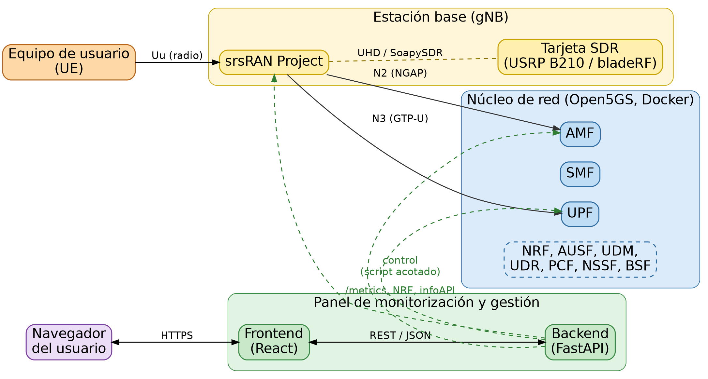

# Panel de monitorización y gestión para redes 5G privadas de código abierto

Trabajo de Fin de Grado — Grado en Ingeniería Informática, Universidad de Extremadura.
Calificación: 10, Matrícula de Honor.

Herramienta de **monitorización y gestión** para una red 5G privada desplegada íntegramente con tecnologías de código abierto: [srsRAN Project](https://www.srsran.com/) como estación base (gNB) y [Open5GS](https://open5gs.org/) como núcleo de red, ejecutado en contenedores Docker. Valida su funcionamiento sobre un despliegue real, incluyendo el registro de un equipo de usuario físico en la red.

Amplía un trabajo predecesor de solo monitorización (Antonio Hidalgo Fernández, TFG 2024, mismo grado y universidad) añadiendo capacidades reales de **gestión activa** (arranque/parada de funciones de red, reconfiguración del gNB, alta y baja de suscriptores), siempre bajo un modelo de **privilegio mínimo**.

## Arquitectura



- **Plano de radio y datos**: el equipo de usuario (UE) se conecta al gNB (srsRAN Project sobre una USRP B210), que se comunica con las diez funciones de red del núcleo (Open5GS, en Docker) mediante las interfaces estándar 5G (N2, N3).
- **Plano de gestión**: un *backend* en Python (FastAPI) monitoriza el estado del núcleo y del gNB, y gestiona ambos siempre a través de *scripts* acotados con privilegio mínimo (`sudoers`), nunca con acceso directo. Un *frontend* en React consume esa información.

## Estructura del repositorio

```
dashboard-backend/    API en FastAPI: monitorización, gestión, autenticación
dashboard-frontend/   Interfaz web en React + Vite + Tailwind CSS
docs/                 Diagrama de arquitectura
```

Cada proyecto tiene su propio `README.md` con instrucciones de instalación, configuración y ejecución de pruebas.

## Puesta en marcha rápida

```bash
# 1. Backend
cd dashboard-backend
python3 -m venv venv && source venv/bin/activate
pip install -r requirements.txt
cp .env.example .env   # ajusta credenciales y rutas -- ver README del backend
uvicorn app.main:app --host 0.0.0.0 --port 8000

# 2. Frontend (en otra terminal)
cd dashboard-frontend
npm install
cp .env.example .env   # ajusta la URL del backend si no es la misma máquina
npm run dev
```

**Importante**: para las funciones de gestión (arrancar/parar el núcleo o el gNB) hace falta además configurar el privilegio mínimo vía `sudoers` — este es un paso manual, con instrucciones detalladas en el [`README` del *backend*](dashboard-backend/README.md#configurar-el-privilegio-mínimo-para-el-control-del-gnb-y-del-core).

## Adaptarlo a tu propia red

Todo lo específico de tu máquina o tu red (direcciones IP, rutas de instalación, credenciales) vive en **dos ficheros no versionados**, generados a partir de sus plantillas (`.env.example`, `deployment.conf.example`) — nunca hace falta tocar el código en sí. Consulta la sección "Portabilidad" del README del *backend* para el detalle completo.

## Documentación completa

La memoria completa del TFG (justificación de cada decisión técnica, incidencias reales resueltas durante el desarrollo, resultados) está disponible [aquí](#) *(añade el enlace si decides compartirla)*.

## Licencia

Este proyecto está publicado bajo la licencia [GNU GPLv3](LICENSE).
